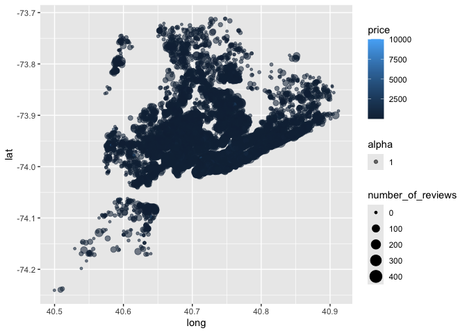
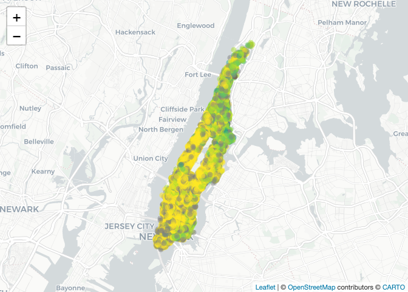

case_study
================
Dylan Morgan
2024-10-08

``` r
library(p8105.datasets)
library(tidyverse)
```

    ## ── Attaching core tidyverse packages ──────────────────────── tidyverse 2.0.0 ──
    ## ✔ dplyr     1.1.4     ✔ readr     2.1.5
    ## ✔ forcats   1.0.0     ✔ stringr   1.5.1
    ## ✔ ggplot2   3.5.1     ✔ tibble    3.2.1
    ## ✔ lubridate 1.9.3     ✔ tidyr     1.3.1
    ## ✔ purrr     1.0.2     
    ## ── Conflicts ────────────────────────────────────────── tidyverse_conflicts() ──
    ## ✖ dplyr::filter() masks stats::filter()
    ## ✖ dplyr::lag()    masks stats::lag()
    ## ℹ Use the conflicted package (<http://conflicted.r-lib.org/>) to force all conflicts to become errors

``` r
library(dplyr)
library(leaflet)

data(nyc_airbnb)
```

## Brainstorm Questions

- Where are max and min airbnb prices?
  - What are average prices?
  - What factors affect prices?
- Where are prices going up and down over time?
- What’s the relationship between number of reviews and average review?
- Does room type affect availability?
- What’s the location of the unit?
  - What areas are popular?
  - Popularity = number of units? Average price?
- Are there repeat host?
  - If so, what does that mean?

``` r
nyc_airbnb |> 
  group_by(neighbourhood_group, room_type) |> 
  summarize(mean_price = mean(price)) |> 
  pivot_wider(
    names_from = room_type,
    values_from = mean_price
  )
```

    ## `summarise()` has grouped output by 'neighbourhood_group'. You can override
    ## using the `.groups` argument.

    ## # A tibble: 5 × 4
    ## # Groups:   neighbourhood_group [5]
    ##   neighbourhood_group `Entire home/apt` `Private room` `Shared room`
    ##   <chr>                           <dbl>          <dbl>         <dbl>
    ## 1 Bronx                            125.           65.5          57.5
    ## 2 Brooklyn                         175.           76.7          59.6
    ## 3 Manhattan                        238.          107.           84.7
    ## 4 Queens                           140.           70.6          49.1
    ## 5 Staten Island                    207.           65.4          25

``` r
ggplot() + 
  geom_point(data = nyc_airbnb, 
             mapping = 
               aes(x = long, 
                   y = lat, 
                   size = number_of_reviews, 
                   alpha = 1, 
                   color = price))
```

<!-- -->

Leaflet

``` r
pal <- colorNumeric(
  palette = "viridis", 
  domain = nyc_airbnb$review_scores_location
)

nyc_airbnb |> 
  filter(neighbourhood_group == "Manhattan", 
         price < 1000) |> 
  leaflet() |> 
  addProviderTiles(providers$CartoDB.Positron) |> 
  addCircleMarkers(~lat, ~long, color = ~pal(review_scores_location), radius = 2)
```

<!-- -->
